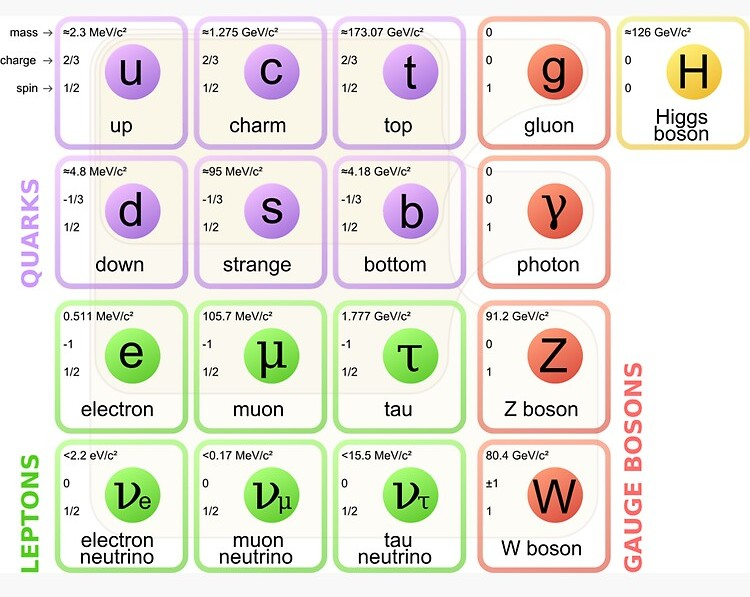

# ⚛️ QuantumPhysics

## Modélisation des particules fondamentales de l'univers

[](https://www.php.net/releases/8.3/)

Un projet éducatif en **PHP** visant à modéliser les **particules fondamentales** du Modèle Standard
(fermions, bosons, interactions fondamentales).  

L’objectif est de créer une **représentation orientée objet** des concepts de la physique des particules,
tout en respectant les bonnes pratiques de conception logicielle (PSR-4, exceptions, typage strict, interfaces).



---

## 🎯 Objectifs pédagogiques

- Comprendre comment **traduire un concept scientifique en objet logiciel**.  
- Manipuler les bases de la **POO avancée en PHP** (interfaces, héritage, exceptions, typage strict).  
- Illustrer des notions de physique : spin, charge, masse, antiparticules, classification.  
- Structurer un projet PHP en respectant les standards de l’industrie (PSR-4).  

---

## ⚙️ Installation

- Cloner le dépôt puis installer les dépendances :

```bash
git clone https://github.com/jc-aziaha/quantum-physics.git
cd quantum-physics
```

- Lancer Docker
```bash
docker-compose up --build
```

- Exécuter du code PHP dans le conteneur
```bash
docker exec -it quantum-physics-modeling bash
```

- Installer les dépendances et l'auto-chargeur des classes de composer
```bash
composer install
```

---

## 🚀 Exemple d’utilisation

Voici un exemple simple avec un électron et son antiparticule :

```php
<?php

require 'vendor/autoload.php';

use QuantumPhysics\Particles\Fermions\Leptons\Electron;

$electron = new Electron();

echo $electron->getName();   // "Electron"
echo $electron->getCharge(); // -1
echo $electron->getSpin();   // 0.5

$positron = $electron->getAntiparticle();
echo $positron->getName();   // "Positron"
```

---

## 📖 Sources et inspirations

- *Introduction to Elementary Particles* – David Griffiths  
- *The Standard Model: A Primer* – Coughlan, Dodd & Gripaios  
- [Wikipedia: Modèle standard de la physique des particules](https://fr.wikipedia.org/wiki/Mod%C3%A8le_standard)  
- Discussions pédagogiques et expérimentations personnelles  

---

## 🧑‍💻 Auteur

Projet réalisé par **Jean-Claude AZIAHA** dans un but pédagogique,  
pour explorer les liens entre **physique théorique** et **programmation orientée objet**.

---

## 📜 Licence

Ce projet est sous licence MIT – utilisation libre à des fins pédagogiques et expérimentales.